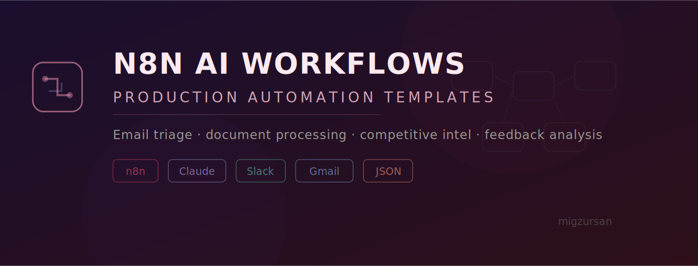

<p align="center">
  
</p>

<p align="center">
  <strong>A collection of n8n workflows that combine AI with practical business automation. Built from real operations experience, not tutorials.</strong>
</p>

<p align="center">
  
  
  
  
  
</p>

<p align="center">
  <a href="#workflows">Workflows</a> •
  <a href="#how-to-use">How to Use</a> •
  <a href="#architecture-patterns">Patterns</a> •
  <a href="#lessons-learned">Lessons</a>
</p>

---

## Why This Repo?

Most n8n + AI tutorials show toy examples: "summarize an email with GPT." Real operations automation is messier. You need error handling, rate limiting, human-in-the-loop approval, and fallback paths.

These workflows come from hands-on experience automating operations across product, support, and data teams. Each one is importable, documented, and designed for production use.

---

## Workflows

### 1. Intelligent Email Triage & Routing

**Problem:** High-volume shared inboxes where emails need to be classified and routed to the right team.

**What it does:**
- Monitors a Gmail/Outlook inbox
- Uses Claude to classify each email by intent (support request, sales inquiry, partnership, spam, internal)
- Routes to the correct Slack channel or assignee
- Adds structured labels and priority tags
- Escalates urgent items with a summary

```
📧 New Email
    │
    ▼
🤖 Claude: Classify intent + extract entities
    │
    ├──▶ Support → #support-queue (Slack) + create ticket
    ├──▶ Sales → #sales-leads (Slack) + add to CRM
    ├──▶ Partnership → notify BD team
    ├──▶ Urgent → immediate Slack alert + SMS
    └──▶ Spam → archive + label
```

**File:** [`workflows/email-triage.json`](workflows/email-triage.json)

**Screenshot:**

<p align="center">
  
</p>

---

### 2. Document Processing Pipeline

**Problem:** Incoming documents (invoices, contracts, reports) need to be parsed, key data extracted, and routed to the right system.

**What it does:**
- Watches a Google Drive folder for new uploads
- Detects document type (invoice, contract, report, other)
- Extracts key fields using Claude's vision capabilities
- Pushes structured data to Google Sheets or your database
- Flags anomalies (e.g., invoice amount > threshold) for human review

```
📄 New Document in Drive
    │
    ▼
🔍 Detect type (invoice / contract / report)
    │
    ▼
🤖 Claude Vision: Extract structured fields
    │
    ├──▶ Invoice → Google Sheet + accounting notification
    ├──▶ Contract → Extract terms + flag for legal review
    └──▶ Report → Summarize + distribute to stakeholders
```

**File:** [`workflows/document-processing.json`](workflows/document-processing.json)

---

### 3. Customer Feedback Analyzer

**Problem:** Customer feedback comes from multiple channels (NPS surveys, app reviews, support tickets) and nobody has a unified view.

**What it does:**
- Aggregates feedback from multiple sources on a schedule
- Claude analyzes sentiment, extracts themes, and identifies actionable insights
- Generates a weekly digest with trends, top complaints, and suggested actions
- Posts the digest to Slack and saves to Google Sheets for tracking

```
📊 Sources: NPS + App Reviews + Support Tags
    │
    ▼
🤖 Claude: Sentiment + Theme Extraction
    │
    ▼
📈 Trend Analysis (week-over-week)
    │
    ▼
📋 Weekly Digest → Slack + Google Sheets
```

**File:** [`workflows/feedback-analyzer.json`](workflows/feedback-analyzer.json)

---

### 4. Meeting Notes → Action Items Pipeline

**Problem:** Meeting recordings produce transcripts, but nobody reads them. Action items get lost.

**What it does:**
- Receives meeting transcripts (from Otter.ai, Fireflies, or manual upload)
- Claude extracts: decisions made, action items with owners, open questions, key discussion points
- Creates tasks in Asana/Jira with proper assignees
- Posts a structured summary to the relevant Slack channel
- Tracks action item completion in follow-up runs

```
🎙️ Meeting Transcript
    │
    ▼
🤖 Claude: Extract decisions + action items + owners
    │
    ├──▶ Action items → Asana tasks (with assignees)
    ├──▶ Summary → Slack channel
    └──▶ Open questions → follow-up reminder (scheduled)
```

**File:** [`workflows/meeting-actions.json`](workflows/meeting-actions.json)

---

### 5. Competitive Intelligence Monitor

**Problem:** Tracking competitor changes (pricing, features, announcements) is tedious and inconsistent.

**What it does:**
- Periodically fetches competitor websites and RSS feeds
- Claude compares current vs. previous snapshot and identifies changes
- Classifies changes: pricing, new feature, hiring signal, partnership, marketing campaign
- Generates a weekly competitive brief
- Alerts immediately on high-impact changes (pricing changes, major launches)

```
🌐 Competitor Sites + RSS (scheduled)
    │
    ▼
📸 Snapshot + diff vs. previous
    │
    ▼
🤖 Claude: Classify changes + assess impact
    │
    ├──▶ High impact → immediate Slack alert
    └──▶ All changes → weekly competitive brief
```

**File:** [`workflows/competitive-intel.json`](workflows/competitive-intel.json)

---

## How to Use

### Import a Workflow

1. Open your n8n instance
2. Go to **Workflows** → **Import from file**
3. Select the `.json` file from the `workflows/` folder
4. Configure credentials (each workflow's README specifies which ones)
5. Activate

### Credential Requirements

| Workflow | Required Credentials |
|---|---|
| Email Triage | Gmail/Outlook OAuth, Slack, Claude API key |
| Document Processing | Google Drive OAuth, Claude API key, Google Sheets |
| Feedback Analyzer | Various source APIs, Claude API key, Slack |
| Meeting Actions | Claude API key, Asana/Jira, Slack |
| Competitive Intel | Claude API key, Slack |

### Environment Setup

```bash
# Clone the repo
git clone https://github.com/migzursan/n8n-ai-workflows.git
cd n8n-ai-workflows

# Each workflow has its own documentation
ls workflows/
# email-triage.json
# document-processing.json
# feedback-analyzer.json
# meeting-actions.json
# competitive-intel.json

# Each workflow has a companion README
ls docs/
# email-triage.md
# document-processing.md
# feedback-analyzer.md
# meeting-actions.md
# competitive-intel.md
```

---

## Architecture Patterns

These workflows share common patterns worth documenting:

### Pattern 1: LLM with Structured Output

Every AI node uses a structured output prompt pattern to ensure parseable results:

```
Analyze the following email and respond ONLY with a JSON object:

{
  "intent": "support|sales|partnership|spam|internal",
  "priority": "critical|high|medium|low",
  "summary": "one sentence summary",
  "entities": {
    "customer_name": "...",
    "product_mentioned": "...",
    "urgency_signals": ["..."]
  }
}

Email content:
{{$json.body}}
```

### Pattern 2: Human-in-the-Loop Gates

High-stakes actions (sending emails, creating tickets, financial operations) never auto-execute. They go through an approval step:

```
AI Decision → Slack Message with Approve/Reject buttons → Wait for response → Execute or skip
```

### Pattern 3: Error Handling + Retry

Every external API call follows the same pattern:

```
API Call → Success? → Continue
              │
              No → Retry (3x with backoff)
                      │
                      Still failing → Alert to Slack + log error + continue with fallback
```

### Pattern 4: Rate Limiting for LLM Calls

When processing batches (e.g., 50 emails), workflows include a rate limiter node to avoid hitting API limits:

```
Batch of items → Split into chunks of 5 → Process chunk → Wait 2s → Next chunk
```

---

## Project Structure

```
n8n-ai-workflows/
├── workflows/
│   ├── email-triage.json
│   ├── document-processing.json
│   ├── feedback-analyzer.json
│   ├── meeting-actions.json
│   └── competitive-intel.json
├── docs/
│   ├── email-triage.md              # Detailed setup + customization guide
│   ├── document-processing.md
│   ├── feedback-analyzer.md
│   ├── meeting-actions.md
│   ├── competitive-intel.md
│   └── screenshots/
│       ├── email-triage.png
│       └── ...
├── patterns/
│   ├── structured-output.md         # Prompt templates for reliable JSON
│   ├── human-in-the-loop.md         # Approval gate patterns
│   └── error-handling.md            # Retry + fallback patterns
├── LICENSE
└── README.md
```

---

## Lessons Learned

### 1. Structured output prompts are non-negotiable
Free-form LLM responses break downstream automations. Every AI node should request JSON, validate the schema, and have a fallback path for malformed responses. I've seen Claude return valid JSON 98%+ of the time, but that 2% will break your workflow at 3am.

### 2. Human-in-the-loop is a feature, not a limitation
The most valuable workflows aren't fully automated — they're the ones that handle 90% automatically and surface the 10% that needs a human decision. This builds trust faster than trying to automate everything.

### 3. Start with the error path
Build the Slack error alert and retry logic before building the happy path. Every n8n workflow will fail eventually (API down, rate limit, malformed input). The ones that fail gracefully are the ones that stay in production.

### 4. Batch ≠ real-time
Email triage works great in real-time (one email at a time). Feedback analysis works better as a daily batch. Competitive intel works best as a weekly scan. Matching the cadence to the use case is a design decision most people skip.

---

## Related Projects

- [Sancho Voice Agent](https://github.com/migzursan/sancho-voice-agent) — Personal AI assistant with modular integrations
- [OmniMind Case Study](https://github.com/migzursan/omnimind-case-study) — Production conversational AI at Vivino
- [migzursan.github.io](https://migzursan.github.io) — Full portfolio

---

<p align="center">
  Built by <a href="https://migzursan.github.io">Miguel Zurbano</a> · Because the best automation is the one that handles its own failures.
</p>
